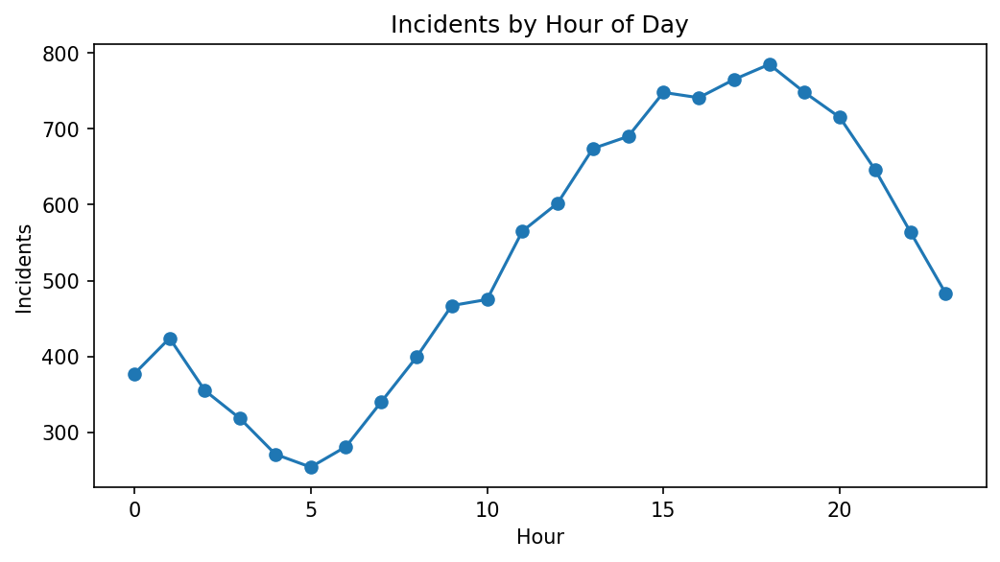
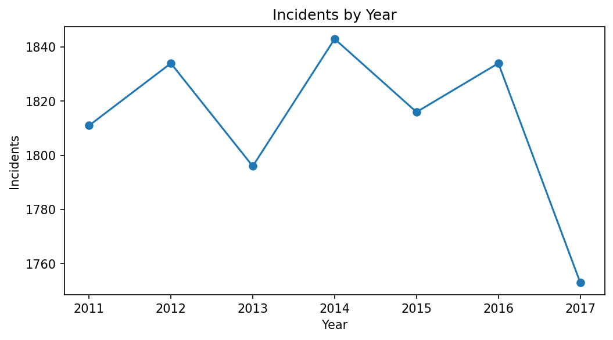
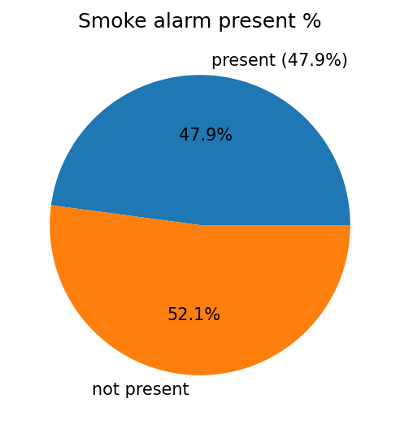

# 🚒 Firefighter Fatalities & Fire Incidents Analysis

## 📖 Overview

This repository contains a comprehensive data analysis project on firefighter fatalities and fire incidents.  
The project combines:

- **SQL Server Queries** (20+ advanced queries for incident analysis)  
- **Python** (Pandas, NumPy, Matplotlib, Seaborn) for exploratory analysis & visualizations  
- **Exported Plots** saved automatically as PNG files  
- **Interactive Power BI Dashboard** (5 pages) for performance monitoring & insights  

The main goal is to uncover insights into **incident patterns, casualties, response performance, fire protection systems, causes, and community impact**.

---

## 📂 Repository Structure

fire-incidents-analysis/
│── data/ # Input datasets (CSV/Excel/SQL extracts)
│── sql_queries/ # 20+ SQL queries for data exploration
│ └── queries.sql
│── python/
│ └── analysis.ipynb # Jupyter Notebook for analysis
│── results/ # Exported CSV from Python
│ ├── casualty_rate_by_property.csv
│ ├── rescue_vs_resources.csv
│ ├── smoke_alarm_impact.csv
| |── percent_smoke_alarm_present.csv
│ └── ...
│── plots/ # Exported charts from Python
│ ├── avg_loss_by_type.png
│ ├── casualties_by_property.png
│ ├── incidents_by_hour.png
│ ├── correlation_loss_time.png
│ └── ...
│── powerbi_dashboard/
│ └── Fire_Incidents_Dashboard.pbix
│── README.md

---

## ⚙️ Project Workflow

### 1. SQL Analysis

20 advanced queries including:

- Casualty rate per property use  
- Incidents with firefighter casualties  
- Median response time by area of origin  
- Correlation between dollar loss & control time  
- Top 10 wards by incidents  
- Smoke alarm presence rate  
- Sprinkler effectiveness vs. loss  

All queries are prepared in `sql_queries/queries.sql`.

---

### 2. Python Analysis & Visualization

- Data imported using **Pandas**  
- Statistical analysis with **NumPy**  
- Visualizations with **Matplotlib/Seaborn**  
- Plots automatically saved in `plots/`  

### 3. Power BI Dashboard
**A 5-page dashboard designed for insights:**
-Incidents Overview: yearly trends, top wards, top origins
-Response Performance: response & control times, casualties
-Fire Protection Systems: alarms, sprinklers, losses
-Causes & Impact: ignition sources, incident types
-Human & Community Impact: rescues, displaced, casualty rates
-Time Analysis: peak hours, hourly distribution

---

### 📊 Key Insights
-Explosions show the highest average estimated loss (~$58K).
-Casualty rate is significantly higher in properties like detention centers and post-secondary schools.
-Smoke alarms are present in only ~48% of cases.
-Sprinklers reduce average loss, but many incidents occur without them.
-Peak incidents occur during evening hours (18:00–19:00).
-Incident counts dropped sharply in 2017 compared to earlier years.

### 📌 Recommendations
-Strengthen fire protection systems (alarms & sprinklers).
-Prioritize resources for high-risk property types.
-Improve response strategies to reduce control time.
-Increase community awareness on prevention.

📸 Plots
Python Visualizations:

---

***✨ Contributions, feedback, and suggestions are always welcome!***

## Author:
**Mohamed Emad Alhadi – Data Analyst**
